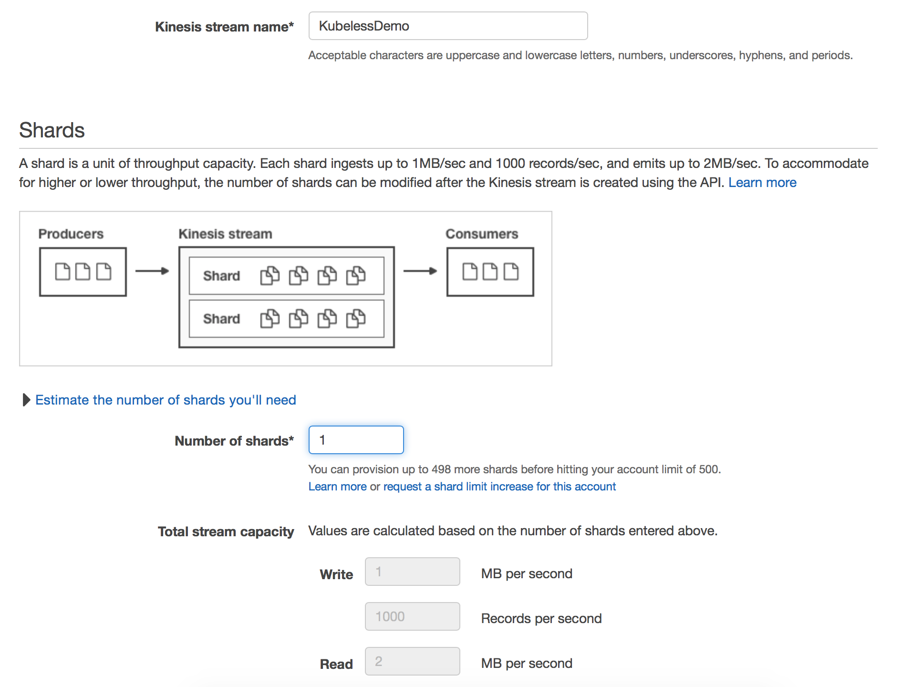

# A hands-on tutorial on using AWS Kinesis streams as Kubeless trigger

Kubeless is a Kubernetes-native FaaS framework that lets you deploy functions without having to worry about the underlying infrastructure used for executing them. It is designed to be deployed on top of a Kubernetes cluster and take advantage of all the great Kubernetes primitives. Kubeless is built around the core concepts of functions, triggers, and runtimes. Triggers in Kubeless represent the event sources and associated functions to be executed on occurence of an event from a given event source. Kubeless supports a wide variety of event sources including AWS [Kinesis](https://aws.amazon.com/kinesis/) streams

Amazon Kinesis is a fully-managed streaming data service that makes it easy to collect, process, and analyze real-time, streaming data; it offers key capabilities to cost-effectively process streaming data at any scale. The unit of data stored by Kinesis Data Streams is a data record: a stream represents a group of data records. You can deploy functions in Kubeless and associate with an AWS Kinesis stream. Kubeless will run the functions in response to records being published to a Kinesis stream.

In the subsequent sections we will go through setting up Kubeless and enabling support for Kinesis stream as trigger. We will go over steps to deploy a function in Kubeless that will be triggered in response to the records published to an AWS Kinesis stream.

## Installation

Please follow the [installation steps](https://github.com/kubeless/kubeless/blob/master/docs/quick-start.md#installation) in the Kubeless quick start quide to deploy Kubeless on a functional Kubernetes cluster.

Once you have a working Kubeless setup please follow the [instructions](https://github.com/kubeless/kubeless/blob/master/docs/streaming-functions.md#aws-kinesis) to setup Kinesis trigger setup in Kubeless

## Example Scenario

Lets consider a real life scenario to illustrate the end-to-end picture and help you appreciate the power of Kinesis and Kubeless.

We will a use a social network feed to get real-time insights, in this example all the tweets being produced during the Kubecon conference. We will run through a scenario where we would like to get real-time notification of the mention of a topic of interest: kubeless :)

Lets see how to build a data processing pipeline by deploying Kubeless functions that are executed when records appear in an Amazon Kinesis stream.

## Setup a Kinesis Stream

Lets start by creating a Kinesis stream using the AWS web console to a create a data stream named `KubelessDemo`.

The snapshot above comes directly from the AWS management console. As you can see, there is very little configuration needed to get started with a stream.

## Settingup Data Producer

Now that we have a Kinesis stream to take the data in, we will use a simple Python program [streaming.py](https://github.com/kubeless/kinesis-demo/blob/master/streaming.py) that uses [boto3](https://github.com/boto/boto3) and [tweepy](https://github.com/tweepy/tweepy) to fetch in real time tweets with the hashtag #kubecon, and ingest the data into the KubelessDemo Kinesis stream. Run the following Python script locally; it will filter for tweets that contain the hashtag #kubelessonaws, and push the data into Kinesis.

